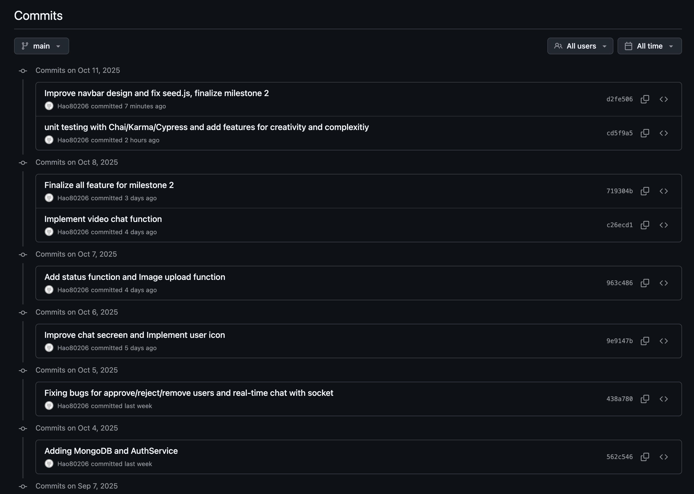
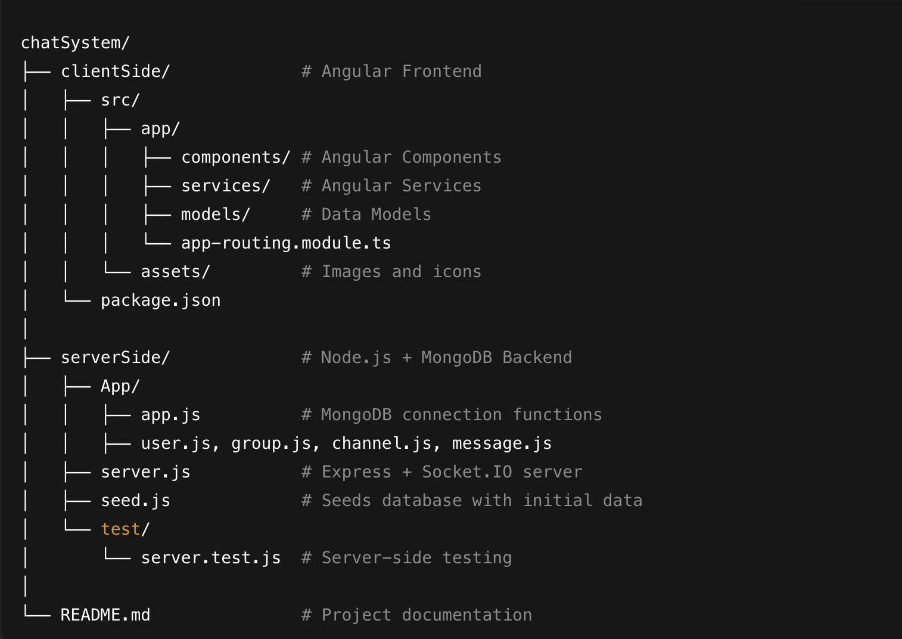

**3813ICT Software Frameworks**


 1. GitHub Commit History
  2. Data Structures
  3. REST API
  4. Angular Architecture

 **1.1 GitHub Commit History and File Structure** 


This project implements a real-time chat system built with Angular, Node.js (Express + Socket.IO), and MongoDB.
It supports multi-user communication through groups and channels, allowing users to send real-time messages, share images, and participate in video chats.

All commits were made directly to the main branch to maintain a clear history and avoid unnecessary merge conflicts during development.

You can acccess my project via following this URL:  https://github.com/hao80206/chatSystem-Angular-Socket 



The development process was as follows:

**Milestone 1**

During the first milestone, I:

Defined and implemented key user roles such as Group_Admin, Super_Admin, and User.

Developed the real-time chat functionality using Socket.IO to enable instant messaging between users in the same channel.

Built the initial Angular components and services to establish the basic frontend structure.

Used JSON files to temporarily store and retrieve data during early development and testing.

**Milestone 2**

In the second milestone, the focus shifted to data persistence, authentication, and enhanced user experience:

Database Integration:
Replaced all JSON-based data storage with MongoDB.
Set up collections for users, groups, channels, and messages, and verified all data using MongoDB Compass during development.

Authentication System:
Implemented AuthService and AuthGuard in Angular to ensure that only verified users can access their dashboard and group pages.

Bug Fixing and Refactoring:
Adjusted existing code to work with the new MongoDB-based backend, improved component organization, and refined UI behavior.

User Experience Improvements:
Added online/offline status indicators and user profile icons to enhance visual clarity and interactivity.

Media Features:
Integrated image upload functionality and introduced a video chat feature, allowing users to communicate more dynamically.

Through these milestones, the project evolved from a simple chat prototype to a fully functional, database-driven, and user-friendly real-time communication system.

---

## **1.2. Data Structures**

This project stores and manages all main entities — Users, Groups, Channels, Messages, and Join Requests — in a MongoDB database.  
While some entities (Users, Groups, Channels) are defined with Angular models on the client side, others (Messages and Join Requests) are stored directly in MongoDB without separate model files.  


### **Client-Side Models**

#### **User**
```ts
export class User {
  id: string;
  username: string;
  email: string;
  password: string;
  role: string[];       // ['USER'], ['GROUP_ADMIN'], or ['SUPER_ADMIN']
  groups: number[];
  profileImg: string;
  status: string;       // 'online' or 'offline'
}

Group:

export class Group {

  id: number;
  name: string;
  createdBy: string; // userId of creator
  channels: string[]; // later if you want channels inside groups
}

Channel:

export class Channel {

  id: number;
  groupId: number;
  name: string;
  members: string[] = []; // user IDs
  bannedUsers: string[] = []; // user IDs

}


Messages (Stored directly in MongoDB): 

{
  channelId: 101,
  senderId: '1',
  senderName: 'Alice',
  content: 'Hello everyone!',
  type: 'text', // or 'image'
  timestamp: new Date(),
  profileImg: '/assets/Icons/woman-img-1.png'
}


JoinRequest (Stored directly in MongoDB):

{
  userId: '5',
  groupId: 2,
}


Server-Side JSON Objects:  
User:

data.users = [

{ id: '1', username: 'Alice', email: 'alice@mail.com', password: '123', role: ['USER'], groups: [1,2,5,7], profileImg: '/assets/Icons/woman-img-1.png', status: 'offline' }

]

Group:

data.groups = [

{ id: 1, name: 'Group1 - Tulip', createdBy: 'Super', channels: [101,102,103,104,105,106,107] }

]

Channel:

data.channels = [

{ id: 101, groupId: 1, name: 'General', members: [], bannedUsers: [] }

]

Messages:[
  {
    channelId: 101, 
    senderId: '1', 
    senderName: 'Alice', 
    content: 'Hello everyone!', 
    type: 'text',
    timestamp: new Date(),
    profileImg: '/assets/Icons/woman-img-1.png'
  }
]


```
---

## 1.3. REST API and Socket Communication

The Angular frontend communicates with the Node.js backend using a combination of **RESTful API routes** and **Socket.IO** for real-time updates.


### REST API

#### User Routes
| Endpoint | Method | Description |
|-----------|--------|-------------|
| `/api/login` | **POST** | Authenticate a user by verifying email and password. Returns user details if valid. |
| `/api/register` | **POST** | Register a new user and store it in MongoDB. Automatically creates join requests for existing groups. |
| `/api/users` | **GET** | Retrieve all registered users. |
| `/api/users/:id` | **GET** | Retrieve specific user information by ID. |
| `/api/users/:id` | **DELETE** | Delete a user, remove them from all groups/channels, and clean up related join requests. |

---

#### Group Routes
| Endpoint | Method | Description |
|-----------|--------|-------------|
| `/api/groups` | **GET** | Retrieve all groups with their channels and members. |
| `/api/groups/:id` | **GET** | Retrieve a specific group by ID, including its channels and members. |
| `/api/groups` | **POST** | Create a new group. Automatically assigns the creator and all SUPER_ADMIN users as members. |
| `/api/groups/:id` | **PUT** | Update group name. |
| `/api/groups/:id` | **DELETE** | Delete a group and all its associated channels, users, and join requests. |

---

#### Channel Routes
| Endpoint | Method | Description |
|-----------|--------|-------------|
| `/api/groups/:id/channels` | **GET** | Retrieve all channels that belong to a specific group. |
| `/api/groups/:id/channels` | **POST** | Create a new channel inside the specified group. |
| `/api/groups/:groupId/channels/:channelId` | **DELETE** | Delete a specific channel within a group. |
| `/api/channels` | **GET** | Retrieve all channels across all groups. |
| `/api/channels/:channelId/messages` | **GET** | Retrieve all messages for a specific channel. |

---

#### Join Request Routes
| Endpoint | Method | Description |
|-----------|--------|-------------|
| `/api/join-requests` | **GET** | Retrieve all pending join requests from all users. |
| `/api/groups/:id/join-requests` | **GET** | Retrieve all join requests for a specific group. |
| `/api/groups/:id/join-requests` | **POST** | Submit a join request for a specific group. |
| `/api/groups/:id/join-requests/:userId/approve` | **POST** | Approve a user’s join request and add them to the group. |
| `/api/groups/:id/join-requests/:userId/reject` | **POST** | Reject a user’s join request. |

---

#### User-Group Routes
| Endpoint | Method | Description |
|-----------|--------|-------------|
| `/api/groups/:groupId/users/:userId` | **DELETE** | Remove a user from a specific group (user leaves group). |
| `/api/groups/:id/users/:userId/promote` | **POST** | Promote a user to `GROUP_ADMIN` or `SUPER_ADMIN`. |
| `/api/groups/:id/users` | **GET** | Retrieve all users who are members of a specific group. |

---

### Socket.IO Communication

The system also uses **Socket.IO** for real-time, two-way communication between the server and the Angular client.  
This enables instant message delivery, user presence updates, and group/channel synchronization without page reloads.

### Socket.IO Events

| Event Name | Direction | Parameters | Return / Response | Description |
|------------|-----------|------------|-----------------|-------------|
| `joinChannel` | Client → Server | `{ channelId, userId }` | Emits `userJoined` to other channel members | Sent when a user joins a channel. Adds the user to the channel room and updates the channel member list in MongoDB. Notifies others in the channel. |
| `leaveChannel` | Client → Server | `{ channelId, userId }` | Emits `userLeft` to other channel members | Sent when a user leaves a channel. Removes the user from the channel room and updates MongoDB. Notifies others in the channel. |
| `sendMessage` | Client → Server | `{ channelId, senderId, content, type }` | Emits `receiveMessage` to channel | Sent when a user sends a message. The server saves the message in MongoDB and broadcasts it to all channel members. |
| `receiveMessage` | Server → Client | `{ channelId, senderId, senderName, content, type, timestamp, profileImg }` | N/A | Broadcasted to all channel members when a new message is received. |
| `typing` | Client → Server | `{ channelId, username }` | Emits `usersTyping` to channel | Sent when a user is typing. Server tracks typing users and broadcasts the current list to channel members. |
| `stopTyping` | Client → Server | `{ channelId, username }` | Emits `usersTyping` to channel | Sent when a user stops typing. Updates the typing list and notifies channel members. |
| `peerIdReady` | Client → Server | `{ channelId, userId, peerId }` | Emits `peerIdReady` to other channel users | Sent when a user’s PeerJS ID is ready for video chat. Broadcasts the peer ID to other users in the channel. |
| `joinVideo` | Client → Server | `{ channelId, userId }` | Emits `userJoinedVideo` to channel | Sent when a user joins a video chat. Notifies other users in the same channel. |
| `leaveVideo` | Client → Server | `{ channelId, userId }` | Emits `userLeftVideo` to channel | Sent when a user leaves a video chat. Notifies other users in the same channel. |
| `createGroup` | Client → Server | `{ name }` | Emits `groupCreated` to all clients | Sent when a new group is created. The server stores the group in MongoDB and notifies all users. |
| `groupCreated` | Server → Client | `{ id, name, channels }` | N/A | Broadcasted to all users when a new group is successfully created. |
| `requestJoinGroup` | Client → Server | `{ userId, groupId }` | Emits `groupRequest` to group room & all clients | Sent when a user requests to join a group. The server checks for duplicates, stores the request, and notifies admins. |
| `approveRequest` | Client → Server | `{ userId, groupId }` | Emits `requestApproved` to group & all clients | Sent when a join request is approved. Adds the user to the group in MongoDB and notifies all users in real time. |
| `rejectRequest` | Client → Server | `{ userId, groupId }` | Emits `requestRejected` to group & all clients | Sent when a join request is rejected. Removes the request from MongoDB and notifies users. |
| `updateStatus` | Client → Server | `{ userId, status }` | Emits `statusChanged` to all clients | Updates a user’s online/offline status in MongoDB and notifies all clients. |
| `createChannel` | Client → Server | `{ name, groupId }` | Emits `channelCreated` to group | Sent when a new channel is created. Updates MongoDB and notifies all group members. |
| `deleteChannel` | Client → Server | `{ channelId, groupId }` | Emits `channelDeleted` to group | Sent to delete a channel. Removes the channel from MongoDB and notifies group members. |
| `promoteUser` | Client → Server | `{ userId, role, groupId }` | Emits `userPromoted` to group | Promotes a user to GROUP_ADMIN or SUPER_ADMIN. Updates MongoDB and notifies the group. |
| `banUser` | Client → Server | `{ channelId, userId }` | Emits `userBanned` to channel, `userBannedFromChannel` to group | Bans a user from a channel, removes them from the members list, updates MongoDB, and notifies both channel and group. |

---

### **Summary**

- **REST API** handles persistent data operations (create, read, update, delete).  
- **Socket.IO** manages instant synchronization and communication events between users.  
- Together, they enable a responsive, real-time chat experience that updates across all connected clients simultaneously.


### **1.4 Angular Architecture**

The Angular frontend follows a modular structure with components, services, and models. The architecture ensures separation of concerns, reactivity, and smooth communication with the Node.js backend using REST APIs and Socket.IO.

---

#### **Components**

- **DashboardComponent**
  - **Purpose:** Main landing page after login. Shows all groups a user belongs to, suggested groups to join, and allows admins to create new groups.
  - **Key Features:**
    - Displays user groups and available groups.
    - Admin-only: Form to create new groups.
    - User actions: join group, delete account.
  - **Methods:**
    - `createGroup(name: string)`: Calls GroupService to create a new group via Socket.IO/REST API.
    - `requestJoinGroup(groupId: number)`: Sends join request to a group.
    - `deleteAccount()`: Deletes the current user and cleans up their data.

- **ChannelListComponent**
  - **Purpose:** Displays all channels within a selected group. Provides admin actions for channel management.
  - **Key Features:**
    - List all channels for a group.
    - Admin-only: create and delete channels.
    - Approve or reject join requests (for group admins).
    - Promote users (for super admins).
  - **Methods:**
    - `openChannel(channelId: number)`: Navigates to selected channel.
    - `createChannel(name: string)`: Adds a new channel.
    - `deleteChannel(channelId: number)`: Removes a channel.
    - `approveRequest(userId: string)`: Approves a join request.
    - `rejectRequest(userId: string)`: Rejects a join request.

- **ChannelChatComponent**
  - **Purpose:** Chat interface for a specific channel, handles messages, typing indicators, and moderation.
  - **Key Features:**
    - Displays messages in real-time.
    - Shows online/offline status.
    - Group-admin-only: ban user from channel.
  - **Methods:**
    - `sendMessage(content: string, type: string)`: Sends message via SocketService.
    - `banUser(userId: string)`: Bans a user from the channel.
    - `userTyping(username: string)`: Sends typing signal to other users.
    - `stopTyping(username: string)`: Stops typing signal.

- **NavbarComponent**
  - **Purpose:** Top navigation bar for authentication and navigation.
  - **Key Features:**
    - Login/logout buttons.
    - Displays current user info.
    - Redirects unauthorized users attempting to access protected routes.
  - **Methods:**
    - `logout()`: Calls AuthService to log out and clear session/local storage.

---

#### **Services**

- **AuthService**
  - **Purpose:** Handles authentication and session management.
  - **Key Features:**
    - Login and registration with backend API.
    - Stores current user in localStorage/sessionStorage.
    - Provides helper methods for guards and access control.
  - **Methods:**
    - `login(username: string, password: string)`: Calls `/api/login` and stores user info.
    - `logout()`: Clears stored user data.
    - `getCurrentUser()`: Returns the currently logged-in user.
    - `isAuthenticated()`: Boolean check for AuthGuard.
    
## 1. **UserService**
**Purpose:** Handles all user-related operations, current user management, roles, and group membership.  

**Key Properties:**
- `currentUser: User | null` – currently logged-in user.
- `pendingRequests` – pending group join requests.
- `currentChannelId$: BehaviorSubject<number | null>` – reactive current channel ID.

**Methods:**
- `getCurrentUser(): User | null` – returns the current user.
- `setCurrentUser(user: User)` – updates local storage and in-memory user.
- `logout()` – sets user offline and clears local storage.
- `getAllUsers(): Observable<User[]>` – fetch all users from backend.
- `getUserById(userId: string): Observable<User>` – fetch single user.
- `getUsersByGroup(groupId: number): Observable<User[]>` – fetch users in a group.
- `leaveGroup(user: User, groupId: number)` – remove user from a group.
- `letUserJoinGroup(user: User, groupId: number, admin: User): boolean` – approve user join request.
- `removeUserFromGroup(user: User, groupId: number, admin: User)` – remove user from group via API.
- `promoteUser(user: User, role: 'SUPER_ADMIN' | 'GROUP_ADMIN', groupId?: number)` – promote a user.
- `removeUser(user: User)` – remove a user account (self or admin).

**Role Helpers:**
- `isSuperAdmin(user: User): boolean`
- `isGroupAdmin(user: User): boolean`
- `canManageGroup(user: User, groupId: number): boolean`

---

## 2. **GroupService**
**Purpose:** Manages groups, group membership, and real-time updates.  

**Key Properties:**
- `groups: Group[]` – in-memory list of groups.
- `groups$: BehaviorSubject<Group[]>` – reactive group updates.

**Methods:**
- `loadGroups()` – fetch all groups from API.
- `getAllGroups(): Observable<Group[]>` – reactive stream for components.
- `getGroups(): Group[]` – return local list of groups.
- `addGroup(group: Group)` – add group locally (used for socket updates).
- `createGroup(name: string): Observable<Group> | null` – create new group.
- `modifyGroup(groupId: number, newName: string): Observable<Group> | null` – update group name.
- `deleteGroup(groupId: number): Observable<void> | null` – delete group via API.
- `canManageGroup(group: Group): boolean` – helper for permission checks.

---

## 3. **ChannelService**
**Purpose:** Handles channels in groups, joining/leaving, banning users, and CRUD operations.  

**Key Properties:**
- `channels: Channel[]` – local list of channels.
- `channels$: BehaviorSubject<Channel[]>` – reactive stream for channel updates.

**Methods:**
- `loadChannels(groupId: number)` – fetch channels for a group.
- `getAllChannels(): Observable<Channel[]>` – reactive stream for components.
- `getChannelByGroup(groupId: number): Channel[]` – get channels in a group.
- `getChannelById(channelId: number): Channel | undefined` – fetch channel by ID.
- `getChannelsForUser(groupId: number, user: User | null): Channel[]` – filter channels based on roles.
- `joinChannel(user: User, channelId: number): boolean` – join a channel if allowed.
- `updateChannelMembers(channelId: number, members: string[]): Observable<Channel>` – update members via API.
- `addLocalChannel(channel: Channel)` – add channel locally.
- `removeLocalChannel(channelId: number)` – remove channel locally.
- `banUserFromChannel(channelId: number, targetUserId: string): boolean` – ban a user.
- `createChannel(groupId: number, name: string): Observable<Channel> | null` – create new channel.
- `deleteChannel(groupId: number, channelId: number | string): Observable<void> | null` – delete channel.

---

## 4. **SocketService**
**Purpose:** Handles all real-time communication via Socket.IO.  

**Events / Methods:**
- `connect()` – establish socket connection.
- `joinChannel(channelId: number, userId: string)` – join channel room.
- `leaveChannel(channelId: number, userId: string)` – leave channel.
- `sendMessage(message: Message)` – send message to server.
- `onReceiveMessage(callback: (message: Message) => void)` – listen for incoming messages.
- `typing(channelId: number, username: string)` – emit typing indicator.
- `stopTyping(channelId: number, username: string)` – stop typing indicator.
- `createGroup(name: string)` – emit new group creation.
- `onGroupCreated(callback: (group: Group) => void)` – listen for new group events.
- `banUser(payload: { channelId: number, userId: string })` – ban user in real-time.

---

#### **Models**

- `User`, `Group`, `Channel` (previously described in Data Structures section).
- Messages and JoinRequests are stored in MongoDB without Angular models, accessed via services.

---

#### **Routing**

- Angular routing is guarded using **AuthGuard** to prevent unauthorized access.
- Routes:
  - `/dashboard` → DashboardComponent
  - `/group/:id` → ChannelListComponent
  - `/channel/:id` → ChannelChatComponent
  - `/login` → LoginComponent
  - `/register` → RegisterComponent
